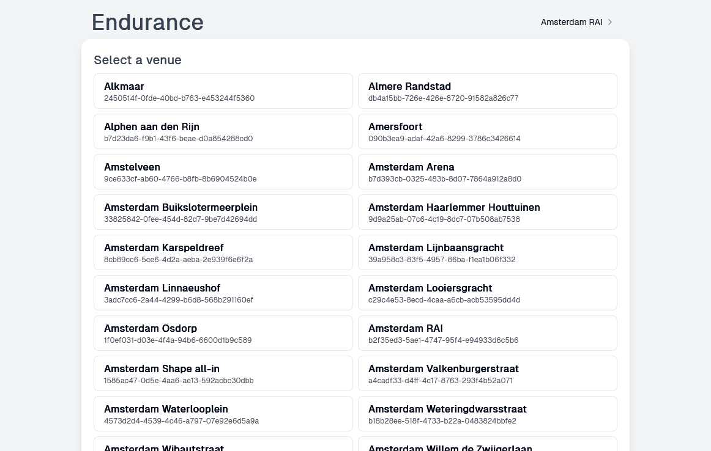

# Endurance

Endurance is a little sideproject I hacked together in a weekend as a personal tool to interact with the SportCity (aka Electrolyte) API. It is designed to monitor and notify users when a spot in a previously fully booked class becomes available. This is particularly useful for anyone wanting to participate in a class without the need to constantly check the SportCity app.

A live version of this project can be found at: [https://endurance.schattgen.dev](https://endurance.schattgen.dev)

## Screenshots




## Project Structure

The project is divided into two main parts:

- **Backend**: Built with .NET, the backend serves as gateway for the SportCity API, a watcher for fully booked classes and sending the notifications.
- **Frontend**: A website built with Vite, React, TypeScript and Shadcn. The frontend provides an interface to communicate with the backend, allowing the users to save watchers for their preferred classes at their venue.

## Getting Started

### Prerequisites

- .NET 8.0
- Node.js and npm
- MySQL (Dockerfile included)
- Docker (optional)

### Configuration

- **Backend Configuration**: Adjust the `appsettings.json` or use environment variables to set up database connections and SMTP settings. An example appsettings.json is included.

  ```
  {
   "Settings": {
       "ConnectionStrings": {
           "MySql": "{MySQL ConnectionString}"
       },
       "Smtp": {
           "Server": "{SMTP host}",
           "Port": {SMTP port},
           "From": "{From email address}",
           "Username": "{SMTP username}",
           "Password": "{SMTP password}"
       }
   }
  }
  ```

- **Frontend Configuration**: Configure the `VITE_API_BASEURL` environment variable in `.env` pointing to the backend. An example .env file is included.

### Setting up locally

1. **Clone the Repository**

   ```
   git clone https://github.com/michaelschattgen/Endurance.git
   cd Endurance
   ```

2. **Backend Setup**

   - Navigate to the backend directory:
     ```
     cd dotnet
     ```
   - Restore dependencies and build the project:
     ```
     dotnet restore
     dotnet build
     ```

3. **Frontend Setup**
   - Navigate to the frontend directory:
     ```
     cd ../frontend
     ```
   - Install dependencies:
     ```
     npm install
     ```
   - Start the development server:
     ```
     npm run dev
     ```

### Running with Docker

- Use Docker to set up the MySQL database. Here's a basic Docker command to get MySQL running:
  ```bash
  docker run --name mysql -e MYSQL_ROOT_PASSWORD=yourpassword -d mysql:latest
  ```
  Make sure to adjust the appsettings.json in the dotnet folder accordingly to make use of the newly created MySQL database. The schema for this project can be found [here](db/schema.sql).

## License

This project is licensed under the GNU General Public License v3.0. See the
[LICENSE](LICENSE) file for details.
